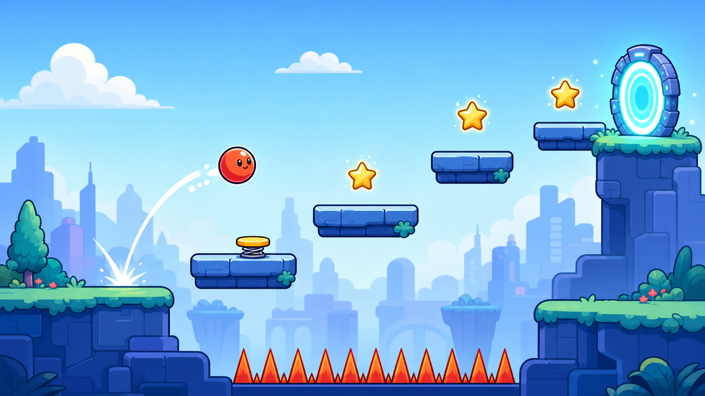

# 바운스 업!

자동으로 튀는 공을 좌우로 조종해 하늘 관문까지 이동하는 1인용 브라우저 게임입니다.



배포 주소: https://cobangpt-web.github.io/bounceball/

## 바로 실행

`start_game.bat`을 더블 클릭하면 로컬 게임 서버와 브라우저가 열립니다.

직접 실행하려면 이 폴더에서 아래 명령을 실행한 뒤
`http://127.0.0.1:4317/`에 접속하세요.

```powershell
python -m http.server 4317 --bind 127.0.0.1
```

## 조작

- 이동: `←` `→` 또는 `A` `D`
- 재시작: `R`
- 일시정지: `Esc`
- 소리 켜기/끄기: `M`
- 모바일: 화면 아래 좌우 버튼
- 게임패드: 왼쪽 스틱 또는 방향 패드

## 스테이지

1. 푸른 언덕 — 기본 이동과 착지
2. 가시 골짜기 — 가시 회피
3. 스프링 시티 — 강화 점프
4. 구름 공장 — 이동·붕괴 발판
5. 하늘 관문 — 모든 기믹이 합쳐진 최종 단계

각 스테이지에는 별 3개와 중간 체크포인트가 있습니다.

## 참고

- 인터넷 연결 없이 실행할 수 있습니다.
- 원본 이미지는 `assets/source`, 게임용 최적화 이미지는 `assets`에 있습니다.
- 개발 상태 표시가 필요하면 주소 끝에 `?dev=1`을 붙이세요.
